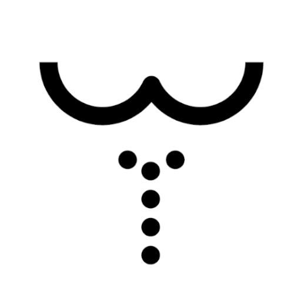

# LETS TOILET - Toilet Simulator

<div align="center">
  
  <br>
  <strong>Experience realistic toilet anytime, anywhere</strong>
  <br>
</div>

## 📱 Application Overview

LETS TOILET is a Flutter-based toilet simulator app for Android & iOS that provides an authentic toilet operation experience.
It features realistic sound effects, vibration feedback, and intuitive controls that mimic real toilet functionality.

### 🎯 Key Features

- **Realistic Toilet Operation**: Authentic toilet-like operation experience with nozzle movement
- **Cross-platform Support**: Android & iOS compatibility
- **Multi-language Support**: Japanese, English, Chinese (3 languages)
- **Google Mobile Ads**: Banner ads integration
- **Firebase Integration**: Analytics, App Check for security
- **Audio & Vibration Feedback**: Realistic operation feel with authentic sounds
- **Responsive Design**: Adaptive UI for different screen sizes
- **Customizable Settings**: Adjustable washing strength and music volume

## 🚀 Technology Stack

### Frameworks & Libraries
- **Flutter**: 3.3.0+
- **Dart**: 2.18.0+
- **Firebase**: Analytics, App Check
- **Google Mobile Ads**: Banner advertisement display

### Core Features
- **Audio**: just_audio for realistic sound effects
- **Vibration**: vibration for haptic feedback
- **Localization**: flutter_localizations with multi-language support
- **Environment Variables**: flutter_dotenv for secure configuration
- **App Tracking Transparency**: app_tracking_transparency for iOS compliance
- **State Management**: hooks_riverpod, flutter_hooks for reactive UI
- **WebView**: webview_flutter for embedded content

## 📋 Prerequisites

- Flutter 3.3.0+
- Dart 2.18.0+
- Android Studio / Xcode
- Firebase (App Check, Analytics)

## 🛠️ Setup

### 1. Clone the Repository
```bash
git clone <repository-url>
cd washlet_button
```

### 2. Install Dependencies
```bash
flutter pub get
```

### 3. Environment Variables Setup
Create `assets/.env` file and configure required environment variables:
```env
IOS_BANNER_UNIT_ID="your-ios-banner-id"
ANDROID_BANNER_UNIT_ID="your-android-banner-id"
IOS_BANNER_TEST_ID="your-ios-test-banner-id"
ANDROID_BANNER_TEST_ID="your-android-test-banner-id"
```

### 4. Firebase Configuration (Optional)
If using Firebase:
1. Create a Firebase project
2. Place `google-services.json` (Android) and `GoogleService-Info.plist` (iOS)
3. These files are automatically excluded by .gitignore

### 5. Run the Application
```bash
# Android
flutter run

# iOS
cd ios
pod install
cd ..
flutter run
```

## 🎮 Application Structure

```
lib/
├── main.dart                    # Application entry point
├── homepage.dart                # Main toilet interface (includes HomeWidget)
├── audio_manager.dart           # Audio management system
├── admob_banner.dart            # Banner advertisement management
├── constant.dart                # Constant definitions
├── extension.dart               # Extension functions for responsive design
├── firebase_options.dart        # Firebase configuration
└── l10n/                        # Localization
    ├── app_en.arb
    ├── app_ja.arb
    └── app_zh.arb

assets/
├── images/                      # Image resources
│   ├── icon.png                # App icon
│   ├── appIcon.png             # Adaptive icon
│   ├── toilet.jpg              # Main toilet image
│   ├── wash.png                # Start wash button
│   ├── black.png               # Stop wash button
│   ├── music.png               # Music button
│   ├── flush.png               # Flush button
│   ├── water1.png - water5.png # Water animation images
│   └── transparent.png         # Transparent overlay
├── audios/                     # Audio files
│   ├── wash.mp3               # Washing sound (loop)
│   ├── prepWash.m4a           # Pre-washing sound
│   ├── river.mp3              # Background music (river sound)
│   ├── flush.mp3              # Flush sound
│   └── none.mp3               # Placeholder audio
└── fonts/                      # Font files
    ├── Roboto-Regular.ttf
    └── cornerstone.ttf
```

## 🎨 Features

### Toilet Operation
- **Start/Stop Washing**: Realistic toilet operation with nozzle movement
- **Washing Strength Control**: 5-level adjustable washing strength (1-5)
- **Pre-washing Sound**: Authentic pre-washing sound effect
- **Water Animation**: Visual water animation based on strength level

### Music System
- **Background Music**: Relaxing river sound for ambient experience
- **Volume Control**: 3-level music volume adjustment (1-3)
- **Play/Stop Control**: Independent music playback control

### Flush System
- **Flush Button**: Realistic flush operation with sound and animation
- **Timed Flush**: Automatic flush completion after specified duration

### Visual Feedback
- **Volume Lamps**: Visual indicators for washing strength and music volume
- **Nozzle Animation**: Animated nozzle movement during washing
- **Water Animation**: Dynamic water visualization based on strength
- **Button States**: Visual feedback for all button interactions

### Haptic Feedback
- **Vibration**: Haptic feedback for all button interactions
- **Realistic Feel**: Authentic toilet operation experience

## 📱 Supported Platforms

- **Android**: API 23+
- **iOS**: iOS 14.0+

## 🔧 Development

### Code Analysis
```bash
flutter analyze
```

### Run Tests
```bash
flutter test
```

### Build
```bash
# Android APK
flutter build apk

# Android App Bundle
flutter build appbundle

# iOS
flutter build ios
```

## 🔒 Security

This project includes security measures to protect sensitive information:
- Environment variables for API keys and ad unit IDs
- Firebase configuration files are excluded from version control
- App Check integration for enhanced security
- App Tracking Transparency compliance for iOS

## 📄 License

This project is licensed under the MIT License.

## 🤝 Contributing

Pull requests and issue reports are welcome.

## 📞 Support

If you have any problems or questions, please create an issue on GitHub.

## 🚀 Getting Started

For new developers:
1. Follow the setup instructions above
2. Check the application structure
3. Review the audio and image assets
4. Start with the main.dart file to understand the app flow

---

<div align="center">
  <strong>LETS TOILET</strong> - Experience the world of toilet simulation!
</div>

## Licenses & Credits

This app uses the following open-source libraries:

- Flutter (BSD 3-Clause License)
- firebase_core, firebase_analytics, firebase_app_check (Apache License 2.0)
- google_mobile_ads (Apache License 2.0)
- flutter_dotenv (MIT License)
- just_audio (MIT License)
- vibration (MIT License)
- hooks_riverpod, flutter_hooks (MIT License)
- webview_flutter (BSD 3-Clause License)
- cupertino_icons (MIT License)
- flutter_launcher_icons (MIT License)
- flutter_native_splash (MIT License)
- intl (BSD 3-Clause License)
- flutter_localizations (BSD 3-Clause License)
- app_tracking_transparency (MIT License)

For details of each license, please refer to [pub.dev](https://pub.dev/) or the LICENSE file in each repository.
